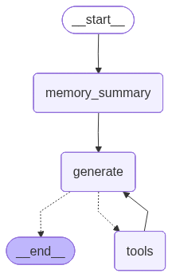
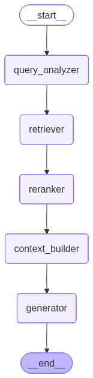

# AgentForge — 探索基于 LangGraph 的智能体实践

[](https://www.python.org/)
[](https://github.com/langchain-ai/langgraph)
[](https://fastapi.tiangolo.com/)
[](https://streamlit.io/)
[](LICENSE)

---

## 🛠️ 技术栈

### **核心框架**
| 组件 | 版本 | 说明 |
|------|------|------|
| **LangGraph** | `1.0.4` | 智能体工作流编排引擎 |
| **LangChain** | `1.0.0` | LLM 应用开发框架 |
| **FastAPI** | `0.124.0` | 高性能异步 Web API 框架 |
| **Streamlit** | `1.52.1` | 快速构建数据应用的框架 |

### **AI & 机器学习**
| 组件 | 版本 | 说明 |
|------|------|------|
| **OpenAI** | `2.9.0` | GPT 系列模型支持 |
| **Anthropic** | `0.75.0` | Claude 模型集成 |
| **Sentence Transformers** | `5.1.2` | 本地 Embedding 模型 |
| **HuggingFace Transformers** | `4.57.3` | Transformer 模型生态 |

### **向量数据库 & 搜索**
| 组件 | 版本 | 说明 |
|------|------|------|
| **ChromaDB** | `1.3.5` | 开源向量数据库 |
| **FAISS** | `1.13.1` | Facebook AI 相似性搜索 |
| **PyTorch** | `2.9.1` | 深度学习框架 |

### **工具集成**
- **MCP (Model Context Protocol)** - 模型上下文协议
- **Web Search** - 网络搜索集成
- **Calculator** - 数学计算工具
- **Document Processing** - 多格式文档处理 (PDF, DOCX, TXT, MD)

### **开发工具**
- **Uvicorn** - ASGI 服务器
- **Pydantic** - 数据验证
- **Rich** - 终端美化
- **Python-dotenv** - 环境配置

---

## 🏗️ 系统架构




### **架构特点**

#### **1. 分层架构设计**
- **表现层**: Streamlit 提供现代化的 Web 界面
- **服务层**: FastAPI 处理高并发 API 请求
- **编排层**: LangGraph 管理复杂的工作流逻辑
- **集成层**: LangChain 统一外部服务接口
- **持久层**: 多存储引擎支持数据持久化

#### **2. 插件化架构**
- **模块化设计**: 各组件独立部署和扩展
- **标准化接口**: 统一的插件协议和数据格式
- **热插拔机制**: 运行时动态加载和卸载组件

#### **3. 可观测性设计**
- **结构化日志**: 完整的请求追踪和错误记录
- **性能监控**: 内置指标收集和性能分析
- **调试支持**: 工作流可视化和状态检查

---

## 📁 项目结构

### **目录说明**

```
AgentForge/
├── assets/
├── configs/                 # 系统与工具配置 (system_config.yaml, mcp_tools.yaml 等)
├── examples/                # 示例与演示脚本
├── scripts/                 # 启动与环境脚本 (start_server.py)
├── src/
│   ├── api/                 # FastAPI 应用与路由
│   │   ├── main.py          # 应用入口
│   │   ├── api_compat.py    # 兼容启动 (start_server 使用)
│   │   ├── models.py        # Pydantic 模型 (ChatRequest 等)
│   │   └── routes/          # 业务路由 (chat/kb/tool/user/system/auth)
│   ├── config/              # SystemConfig 与配置读取
│   ├── core/                # 基础图、节点、状态与 Agent 管理
│   ├── graphs/              # 工作流构建 (react.py, rag.py)
│   ├── knowledge/           # KB 管理、加载、分割与向量存储
│   ├── memory/              # 记忆管理与节点
│   ├── tools/               # MCP、内置工具与传输协议
│   └── webui/               # Streamlit 前端 (chat_ui.py, streamlit_app.py 等)
├── requirements.txt
└── README.md
```

---

## 🚀 快速开始

### **环境要求**
- Python 3.8+
- pip (推荐使用虚拟环境)

### **安装步骤**

#### 1. 克隆项目
```bash
git clone https://github.com/your-username/AgentForge.git
cd AgentForge
```

#### 2. 激活现有虚拟环境
```bash
# 项目使用独立的虚拟环境
# Windows: 激活虚拟环境
D:\Coding\ENVS\AgentForge\Scripts\activate.bat

# Linux/macOS: 激活虚拟环境
# source D:/Coding/ENVS/AgentForge/Scripts/activate
```

#### 3. 环境检查
```bash
# 检查环境状态和依赖安装
python scripts/check_env.py
```

#### 4. 快速启动（推荐）
```bash
# Windows用户：双击运行
start.bat

# 或手动启动
python scripts/start_server.py --mode all
```

#### 3. 配置环境变量
```bash
# 复制环境配置模板
cp .env.example .env

# 编辑配置文件
nano .env
```

#### 4. 启动服务
```bash
# 方式1：一键启动（API + WebUI）
python scripts/start_server.py --mode all

# 方式2：分别启动
# 终端1：启动API服务器
python scripts/start_server.py --mode api --port 7861

# 终端2：启动Web界面
python scripts/start_server.py --mode webui --port 8501
```

#### 5. 访问应用
- **Web 界面**: http://localhost:8501
- **API 文档**: http://localhost:7861/docs

---

## 🛠️ 部署方式

### **开发环境**
```bash
# 使用 Python 虚拟环境
python -m venv venv
source venv/bin/activate  # Windows: venv\Scripts\activate
pip install -r requirements.txt
python scripts/start_server.py --mode all
```

### **生产环境**

---

## 📖 核心功能

### **1. 智能体对话系统**
- ✅ **多轮对话管理** - 基于 LangGraph 的状态管理
- ✅ **工具调用集成** - 支持函数调用和外部 API
- ✅ **记忆系统** - 会话级和全局记忆
- ✅ **流式响应** - 实时对话体验

### **2. 知识库管理系统**
- ✅ **多格式支持** - PDF、DOCX、TXT、Markdown
- ✅ **智能分块** - 递归分割和语义分割
- ✅ **向量检索** - ChromaDB 和 FAISS 支持
- ✅ **增量更新** - 支持文档更新和重新索引

### **3. 工具生态系统**
- ✅ **MCP 协议** - Model Context Protocol 支持
- ✅ **内置工具** - 计算器、网络搜索、知识库查询
- ✅ **插件架构** - 支持自定义工具扩展
- ✅ **工具编排** - 工作流中的工具组合

### **4. 可观测性**
- ✅ **结构化日志** - 完整的请求追踪
- ✅ **性能监控** - API 调用统计和延迟监控
- ✅ **错误处理** - 优雅的错误恢复机制
- ✅ **调试支持** - 工作流状态可视化

---

**⭐ 如果这个项目对你有帮助，请给我们一个 Star！**
